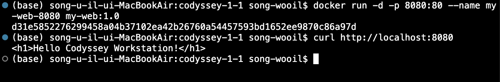
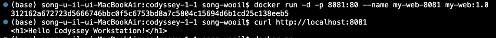
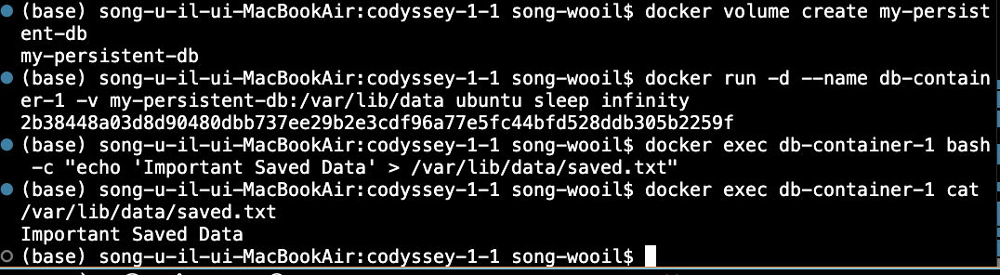

# codyssey-1-1 [내 컴퓨터에 개발자용 작업실 꾸미기]

## 1. 프로젝트 개요
이 프로젝트는 터미널, git/gitHub, Docker, Orbstack를 활용하여 개발 워크스테이션 환경을 구축하고 Docker의 기본적인 사용방법을 익히는 것을 목표로 한다. 터미널을 이용한 파일 및 권한 관리부터 Docker 이미지와 컨테이너의 실행, Dockerfile을 이용한 웹서버 이미지 제작, 포트매핑, 바인드 마운트 및 볼륨을 직접 실습한다. 또한 git을 설정하고 git hub 및 VS Code와 연동하고 실습 과정과 결과를 README에 기록하여 재현 가능한 개발 환경을 구축하는 것을 목표로 한다. 

## 2. 실행 환경
- os: macOS 15.7.5
- CPU: Architecture: x86_64
- Terminal: VS code Integrated Terminal
- Shell: zsh
- git version: 2.54.0
- Docker 실행 환경: Orbstack
- Docker version: 28.5.2

## 2-1. 환경 명령어 로그
~~~bash
#1. OS
sw_vers
#2. CPU
uname -m
#3. shell
echo $SHELL
#4. git version
git --version
#5. Doker version
Docker --version
~~~

## 3. 수행 항목 체크리스트
- [x] 터미널 기본 조작 및 권한 관리
- [x] 파일 목록 확인 (숨김 파일 포함)
- [x] 파일 권한(r/w/x)와 755,644 실습하고 설명
- [x] 디렉토리 이동
- [x] 빈 파일 생성 및 내용 생성
- [x] Docker 설치 및 기본 점검
- [x] Docker 기본 운영
- [x] 컨테이너 실습: Hello world 실행, ubuntu 진입 명령 수행
- [x] Dockerfile 기반 커스텀 웹 서버 이미지 제작: 베이스 이미지 선택, 커스텀 포인트적용, 빌드 및 실행
- [x] 포트 매핑 접속 2회(접속 증거)
- [x] 바인드 마운트 & 볼륨 영속성 검증
  - [x] 바인드 마운트: 호스트 파일 변경 전/후 컨테이너 내부 비교
  - [x] Docker 볼륨: 생성/연결/컨테이너 삭제 전/후 데이터 유지 검증
- [x] git 설정 & github/vscode 연동: 'git config --list' 기록, VSCode GitHub 계정 연동 스크린샷 첨부
- [x] 보안 및 개인정보 보호: 토큰, 비밀번호, 개인키 등 민감정보 마스킹 완료

[터미널 명령어 로그 문서](./terminal_log.md)에서 확인하실 수 있습니다.

## 4. 파일 권한(r/w/x)의 의미와 644 vs 755
- r(read,4): 파일 읽기/디렉토리 목록 조회 권한
- w(Write,2): 파일 수정/디렉토리 내 파일 생성 및 삭제 권한
- x(eXecute,1): 파일 실행/데렉토리 접근(cd)권한
- 644: 실행권한이 없어 단순 문서 파일에 사용하며 디렉토리에 644를 부여하면 실행권한(x)이 사라져 cd로 이동할 수 없게 되므로 디렉토리에는 기본적으로 755 권한을 설정합니다.
- 755: 실행가능 스크립트나 디렉토리에 사용합니다.

## 4-1. 파일 권한 변경
~~~bash
ls -l renamed.txt
-rw-r--r--  1 wooil staff 15 Aug 13 15:05 renamed.txt #변경 전:644(-rw-r--r--)

chmod 755 renamed.txt
ls -l renamed.txt
-rwxr-xr-x  1 wooil staff 15 Aug 13 15:05 renamed.txt #변경 후:755(-rwxr-xr-x)
~~~

## 4-2. 디렉토리 권한 변경
~~~bash
chmod 700 .$ ls -ld .
drwx------  3 wooil  staff  96 Aug 13 15:05 .  # 변경 후: 700 (drwx------)
~~~~
## 5. Docker 기본 점검 및 기본 명령
~~~bash
#1. Docker 버전 확인 및 데몬 정보 확인
docker --version
docker info

#2. 기본 컨테이너 실행 테스트
docker run hello-world

#3. Ubuntu 컨테이너 진입 및 명령어 수행
docker run -it --name ubuntu-test ubuntu bash
#3-1. 컨테이너 내부 실행
ls -la
echo "Inside Ubuntu Container"
exit

#4. 이미지 및 컨테이너 목록, 로그, 리소스 확인
docker images
docker ps -a
docker stats --no-stream
~~~

## 6. Dockerfile 커스텀 이미지 빌드 및 포트 매핑 실행
#1. Dockerfile 생성
~~~bash
#1-1. app 디렉토리 및 기본 html 생성
mkdir -p app
echo "<h1>Hello Codyssey!</h1>" > app/index.html

#1-2. Dockerfile 생성(NGINX 베이스)
cat << 'EOF' > Dockerfile
FROM nginx:alpine
COPY app/index.html /usr/share/nginx/html/index.html
EXPOSE 80
CMD ["nginx", "-g", "daemon dff;"]
EOF
~~~
#2. 작성한 dockerfile 기반 커스텀 이미지 빌드
~~~bash
docker build -t my-web:1.0 .
~~~

#3. 컨테이너 실행 및 포트 매핑(2회)
~~~bash
#3-1. 첫 번째 컨테이너 실행(호스트 8080포트 연결)
docker run -d -p 8080:80 --name my-custom-app my-web:1.0
- 접속 테스트
curl https://localhost:8080
~~~

~~~bash
#3-2. 두 번째 컨테이너 실행(호스트 8081 포트 연결)
docker run -d -p 8081:80 --name my-web-8081 my-web:1.0
- 접속 테스트
curl http://localhost:8081
~~~~

## 7. 바인드 마운트(Bind Mount)실습
: 호스트 컴퓨터의 폴더와 컨테이너 내부 폴더를 연결하여, 호스트에서 파일을 수정하면 컨테이너에도 즉시 반영되는지 검증합니다.
~~~bash
#1. 호스트 실습용 디렉토리 생성 및 초기 파일 작성
mkdir -p ~/codyssey/html-data
echo "Initial Host Data" > ~/codyssey/html-data/index.html

#2. 바인드 마운트 옵션(-v)으로 컨테이너 실행(호스트 8082 포트 연결)
docker run -d -p 8082:80 -v ~/codyssey/html-data:/usr/share/nginx/html --name bind-test nginx:alpine

#3. 변경 전 접속 확인
curl http://localhost:8082
~~~

~~~bash
#4. 호스트에서 파일 내용 수정
echo 'Updated Host Data dynamically!' > ~/codyssey/html-data/index.html

#5. 변경 후 접속 확인 (출력 결과 확인)
curl http://localhost:8082
~~~

## 8. Docker 볼륨 영속성 검증
: 컨테이너를 삭제해도 docker 볼륨에 저장된 데이터는 그대로 유지되는지 검증합니다.
~~~bash
#1.Docker 볼륨 생성
docker volume create my-persistent-db

#2. 첫 번째 컨테이너에 볼륨 연결 후 내부 데이터 작성
docker run -d --name db-container-1 -v my-persistent-db:/var/lib/data ubuntu sleep infinity
docker exec db-container-1 bash -c "echo 'Important Saved Data' > /var/lib/data/saved.txt"
docker exec db-container-1 cat /var/lib/data/saved.txt
~~~
